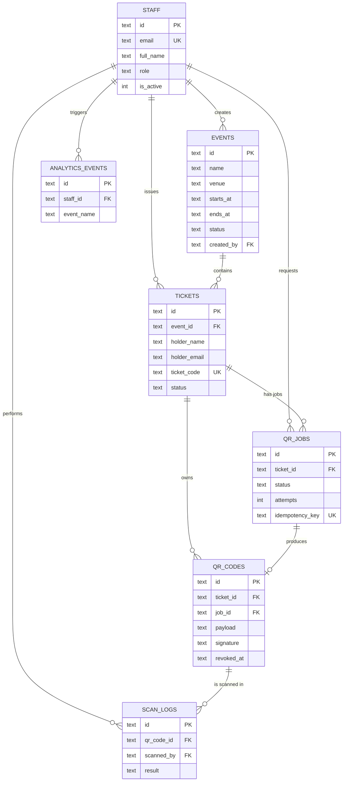

# Entity Relationship Diagram

## Design decisions

- **Idempotency key on `qr_jobs`**: a spotty connection can retry a request safely without creating duplicate jobs.
- **Partial unique index on `qr_codes`**: only one active QR per ticket, while revoked ones stay for audit.
- **`scan_logs` is append-only**: every gate scan is recorded, valid or not.
- **CHECK constraints**: bad data is rejected by the database itself, as a second line of defence behind API validation.